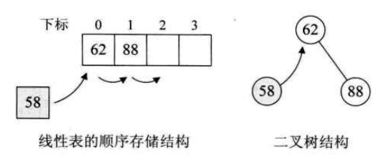
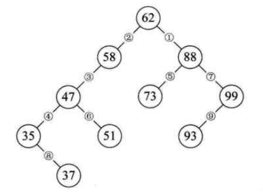
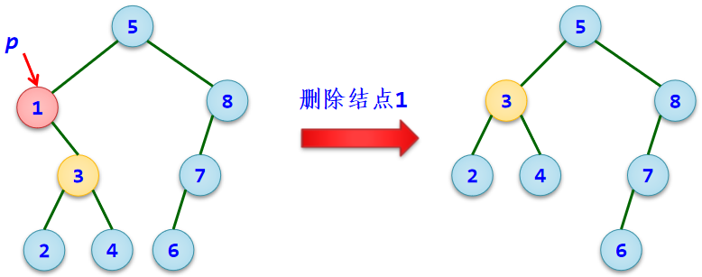
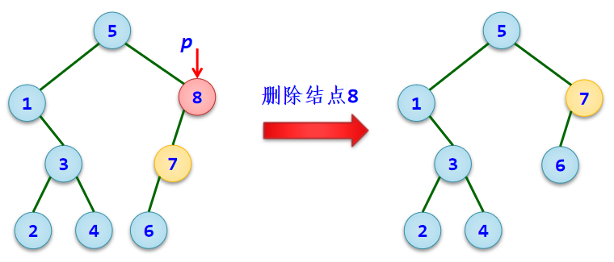
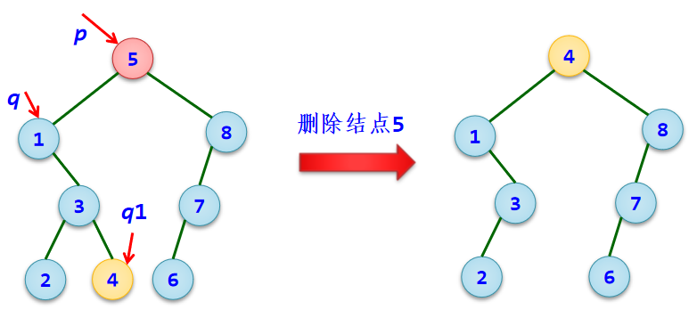
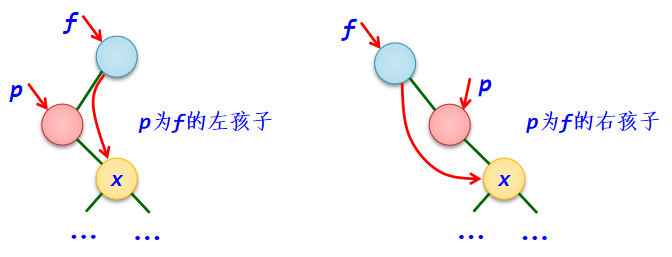
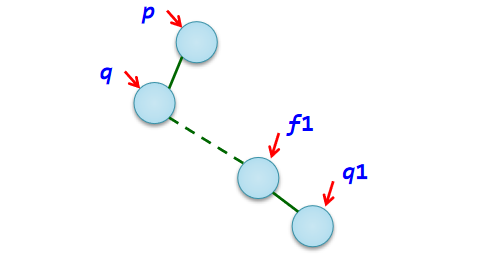

### 二叉排序树


#### 思路

​		对于无序序列，插入操作就是将关键字放到序列末端，序列长度+1，删除操作就是将关键字后面的记录向前移动，序列长度-1，反正序列也没有什么顺序，效率还可以接受。但是这样的无序表查找效率很低。

​		对于有序表，并且是顺序存储的，可以用折半、插值、斐波那契等算法查找，不过有序集在插入和删除上，大部分情况都需要移动很多元素，所以需要耗费大量时间。

而二叉排序树（又称二叉查找树），是一种插入、删除效率还不错，有可以比较高效地查找关键字的数据结构。

​		对于数据集{62，88}，要插入新的数58并且保持有序，在线性表中就需要将62、88后移。但如果使用二叉树，让数据集第一个数62作为根结点，58比62小，所以让他左子树；88 > 62，成为右子树（左孩子 < 根 < 右孩子）。这样，新数的插入就没有影响到旧序列之间的关系




​		假设有无序序列{62，88，58，47，35，73，51，99，37，93}，我们使用二叉排序数存储，进行中序遍历后，就可以得到一个有序序列。



​		构造一棵二叉排序树的目的，并不是为了排序，而是为了提高查找和插入删除关键字的速度。因为在有序数据集上查找，速度总是快于无序数据集的，而二叉树这种非线性的结构，有利于插入删除的实现。


#### 拆解

- 定义二叉排序树的结点的结构

```c
typedef struct bstnode {
    int key;    // 存放关键字
    int data;   // 存放其他数据
    struct bstnode *lchild, *rchild;
};
```


- 插入结点算法

1. 先在树中查找插入新结点的位置，由于二叉排序树中所有新结点都是作为叶子结点插入的，所以这里是查找插入新结点的**父结点**即f结点。
2. 然后建立一个关键字为k的结点p。
3. 若bt为空树，则p结点作为根结点。
4. 若k < f->key，将p结点作为f结点的左孩子插入，反之作为右孩子插入。 

```c
int BSTInsert(BSTNode *&bt,int k) {  // &bt, 取地址, 引用, 不用返回bt, bt也会发生改变。
    BSTNode *f, *p = bt;
    while (p != NULL) {  // 找插入位置,即找插入新结点的双亲f结点
        if (p->key == k)	  // 不能插入相同的关键字
            return 0;
        f = p;  // f指向p结点的双亲结点。因为p结点下一步要在左右子树递归了, 之后f结点自然变成他的父结点。
        if (k < p->key)
            p = p->lchild;	  // 在左子树中查找
        else
            p = p->rchild;	  // 在右子树中查找
    }

    p = (BSTNode *)malloc(sizeof(BSTNode));
    p->key = k;  // 建立一个存放关键字k的新结点p
    p->lchild = p->rchild = NULL;	 //新结点总是作为叶子结点插入的

    if (bt == NULL)  // 原树为空时,p作为根结点插入
        bt = p;
    // 不能改成 if, 不然上一条if判断后, 不会跳过这条而再次执行。
    // 也就是p可能会插入两次, 导致发生错误
    // 注意 if if 和 if else if的区别
    else if (k < f->key)
        f->lchild = p;	// 插入p作为f的左孩子
    else
        f->rchild = p;	// 插入p作为f的右孩子
    return 1;	// 插入成功返回1
}
// 其实很简单，多在上面的图演练几遍
```


- 创建二叉排序树

```c
void CreateBST(BSTNode *&bt, int a[], int n) {
    bt = NULL;  //初始时bt为空树
    int i = 0;
    while (i<n)
    {  BSTInsert(bt,a[i]);  //将关键字a[i]插入到二叉排序树bt中
        i++;
    }
}
```


- 输出树

```c
void Display(BSTNode *bt) {
    if (bt!=NULL)
    {  printf("%d",bt->key);  //输出根结点
        if (bt->lchild!=NULL || bt->rchild!=NULL) {
            printf("(");  //根结点有左或右孩子时输出'('
            Display(bt->lchild);  //递归输出左子树
            if (bt->rchild!=NULL) //有右孩子时输出','
                printf(",");
            Display(bt->rchild);  //递归输出右子树
            printf(")");  //输出一个')'
        }
    }
}


// 中序遍历，输出有序序列
void middle_order(BSTNode *bt) {
    if (bt->lchild != NULL)
        middle_order(bt->lchild);
    printf("%d ", bt->key);
    if (bt->rchild != NULL)
        middle_order(bt->rchild);
}
```


- 销毁树

```c
void DestroyBST(BSTNode *&bt)
{  if (bt!=NULL)
    {	DestroyBST(bt->lchild);
        DestroyBST(bt->rchild);
        free(bt);  //释放根结点
    }
}
```


- 删除结点

​		在二叉排序树bt中删除结点后，仍需要保持二叉排序树的特性。先在二叉排序树中查找关键字为key的结点p，用f指向其双亲结点。删除p结点分以下三种情况。

（1）**若p结点没有左子树**（含p为叶子结点的情况），则用p结点的右孩子替换它。




（2）**若p结点没有右子树**，则用p结点的左孩子替换它。




（3）**若p结点既有左子树又有右子树**，用其左子树中最大的结点替代它。通过p结点的左孩子q找到它的最右下结点q1，q1结点就是p结点**左子树中最大**的结点，将q1结点值替代p结点值，然后将q1结点删除。由于q1结点一定没有有孩子，可以采用（2）的操作删除结点q1。




- 被删结点p没有左子树的情况

```c
if (p->lchild == NULL) {
    if (f == NULL)        // p是根结点,则用右孩子替换它
        bt = p->rchild;
    // 被删结点p没有左子树的情况
    else if (f->lchild == p)  // p是f的左孩子,则用其右孩子替换它
        f->lchild = p->rchild;
    else if (f->rchild == p)  // p是f的右孩子,则用其右孩子替换它
        f->rchild = p->rchild;
    free(p);            // 释放被删结点
}
```



（被删结点无右子树同理，不再赘述）


- 被删结点既有左子树又有右子树的情况

```c
q = p->lchild;        // q指向p结点的左孩子
if (q->rchild == NULL) {    // 若q结点无右孩子
    p->key = q->key;    // 用q结点值代替p
    p->lchild = q->lchild;    // 删除q结点
    free(q);        // 释放q结点
} else {   // 若q结点有右孩子
    f1 = q;  // q要固定在原位,找到q1后交换值,所以要用f1来进行下面的操作
    q1 = f1->rchild;
    while (q1->rchild != NULL) {  //查找q结点的最右下结点q1
        f1 = q1;            //f1指向q1结点的双亲结点
        q1 = q1->rchild;
    }
    p->key = q1->key;        // 将p结点值用q1结点值代替
    if (f1->lchild == q1)	    // 删除q1结点:q1是f1的左孩子
        f1->lchild = q1->rchild;
    else if (f1->rchild == q1)  // 删除q1结点:q1是f1的右孩子
        f1->rchild = q1->lchild;
    free(q1);  // 释放q1所占空间
}
```





#### 完整代码

```c
#include <stdio.h>
#include <stdlib.h>

typedef struct bstnode {
    int key;    // 存放关键字
    int data;    // 存放结点的其他数据
    struct bstnode *lchild, *rchild;
}BSTNode;

int BSTInsert(BSTNode *&bt,int k) {
    BSTNode *f, *p = bt;
    while (p != NULL) {
        if (p->key == k)
            return 0;
        f = p;
        if (k < p->key)
            p = p->lchild;
        else
            p = p->rchild;
    }

    p = (BSTNode *)malloc(sizeof(BSTNode));
    p->key = k;
    p->lchild = p->rchild = NULL;

    if (bt == NULL)
        bt = p;
    else if (k < f->key)
        f->lchild = p;
    else
        f->rchild = p;
    return 1;	// 插入成功返回1
}


void CreateBST(BSTNode *&bt, int a[], int n) {
    bt = NULL;  //初始时bt为空树
    int i = 0;
    while (i<n)
    {  BSTInsert(bt,a[i]);  //将关键字a[i]插入到二叉排序树bt中
        i++;
    }
}


int BSTDelete(BSTNode *&bt,int k) {
    BSTNode *p = bt, *f, *q, *q1, *f1;
    f = NULL;
    if (bt == NULL) return 0;
    while (p != NULL) {
        if (p->key == k)
            break;
        f = p;
        if (k < p->key)
            p = p->lchild;
        else
            p = p->rchild;
    }

    if (p == NULL) return 0;

    // 1. 被删结点p没有左子树的情况
    else if (p->lchild == NULL) {
        if (f == NULL)
            bt = p->rchild;
        else if (f->lchild == p)
            f->lchild = p->rchild;
        else if (f->rchild == p)
            f->rchild = p->rchild;
        free(p);
    }

    // 2. 被删结点p没有右子树的情况
    else if (p->rchild == NULL) {
        if (f == NULL)
            bt = p->lchild;
        if (f->lchild == p)
            f->lchild = p->lchild;
        else if(f->rchild == p)
            f->rchild = p->lchild;
        free(p);
    }

    // 3. 结点p既有左子树又有右子树的情况
    else {
        q = p->lchild;
        if (q->rchild == NULL) {
            p->key = q->key;
            p->lchild = q->lchild;
            free(q);
        } else {
            f1 = q;
            q1 = f1->rchild;
            while (q1->rchild != NULL) {
                f1 = q1;
                q1 = q1->rchild;
            }
            p->key = q1->key;
            if (f1->lchild == q1)
                f1->lchild = q1->rchild;
            else if (f1->rchild == q1)
                f1->rchild = q1->lchild;
            free(q1);
        }
    }
    return 1;
}


void DestroyBST(BSTNode *&bt)
{  if (bt!=NULL)
    {	DestroyBST(bt->lchild);
        DestroyBST(bt->rchild);
        free(bt);  //释放根结点
    }
}


void Display(BSTNode *bt) {
    if (bt!=NULL)
    {  printf("%d",bt->key);
        if (bt->lchild!=NULL || bt->rchild!=NULL) {
            printf("(");
            Display(bt->lchild);
            if (bt->rchild!=NULL)
                printf(",");
            Display(bt->rchild);
            printf(")");
        }
    }
}


// 中序遍历
void middle_order(BSTNode *bt) {
    if (bt->lchild != NULL)
        middle_order(bt->lchild);
    printf("%d ", bt->key);
    if (bt->rchild != NULL)
        middle_order(bt->rchild);
}

int main()
{
    BSTNode *bt;
    int a[] = {11, 12, 40, 20, 2, 44, 33, 23};
    int len = sizeof(a) / sizeof(a[0]);
    CreateBST(bt, a, len);
    printf("BST: "); middle_order(bt); printf("\n");

    if (BSTDelete(bt,12))
        printf("BST: "); middle_order(bt); printf("\n");
    if (BSTDelete(bt,40))
        printf("BST: "); middle_order(bt); printf("\n");

//    Display(bt);
}
```

- 结果

```c
BST: 2 11 12 20 23 33 40 44
BST: 2 11 20 23 33 40 44
BST: 2 11 20 23 33 44
```

